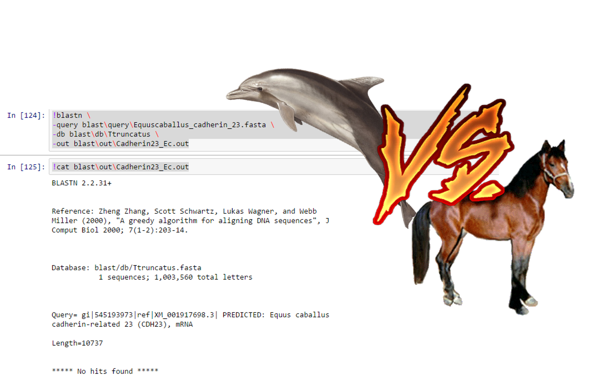

---
#*Food habits, blindness & the development of the echolocation*
---


Hearing is a specialized form of mechanosensation that allows an organism to perceive and respond to sound waves in air (like bats) and in water (like dolphins); therefore, it allows animals to relate to the environment. 

Many animals have the ability to hear, but the sensory input is not utilized in the same ways for all. Some animals have evolved the specialized ability to use sound to produce images of both themselves and other objects within a setting, much as humans use vision.


The ability of bats and toothed whales to echolocate is a remarkable case of convergent evolution. Echolocation involves complex mechanisms. 

---

#But, What about the relationship inter these groups?


Shen et al. (2012) screen three genes that play different roles in this auditory system. They say that Cadherin 23 (Cdh23), one of the three genes, and its ligand, protocadherin 15 (Pcdh15), are essential for bundling motility in the sensory hair. Their found that positive selection, parallel evolution, and perhaps co-evolution and gene expression affect multiple hearing genes that play different roles in audition, including voltage and bundle motility in cochlear amplification, nerve transmission, and brain function.

---

#What happens if I Blast the genome of a Odontoceti against to a bat's Cdh23 gene? 


I download the complete genome of *Tursiops truncatus* from the Genbank page:

[http://www.ncbi.nlm.nih.gov/nuccore/460364176?report=fasta](http://www.ncbi.nlm.nih.gov/nuccore/460364176?report=fasta)

I used this FASTA file like my database 
**Script (Software Jupyter):**
```!makeblastdb \
-dbtype nucl \
-in blast/db/Ttruncatus.fasta \
-out blast/db/Ttruncatus```

Then I looking for some Cdh23 genes from diferent species 


Cadherin-23 gene of *Mus musculus*

>Example of the Script (Software Jupyter):

```!tblastn \
-query blast\query\Cadherin23_of_Mm_Ec1_2.fasta \
-db blast\db\Ttruncatus \
-out blast\out\Cadherin23_Mm.out

!cat blast\out\Cadherin23_Mm.out```

Equally to *Mus musculus* I founded:

- A Cadherin-23 gene of *Equus caballus* (horse)
- The complete chromosome 10 of *Homo sapiens*. This chromosome contains the Cadherin-23 gene.
- RAG 2 gene from *Myotis daubentoni* (bat)
- A Cadherin-23 gene of *Myotis lucifugus* (bat)

---
#Results
---





>**Literature cited:**

>Shen, Y. Y., Liang, L., Li, G. S., Murphy, R. W., & Zhang, Y. P. (2012). Parallel evolution of auditory genes for echolocation in bats and toothed whales. PLoS Genet, 8(6), e1002788-e1002788.
